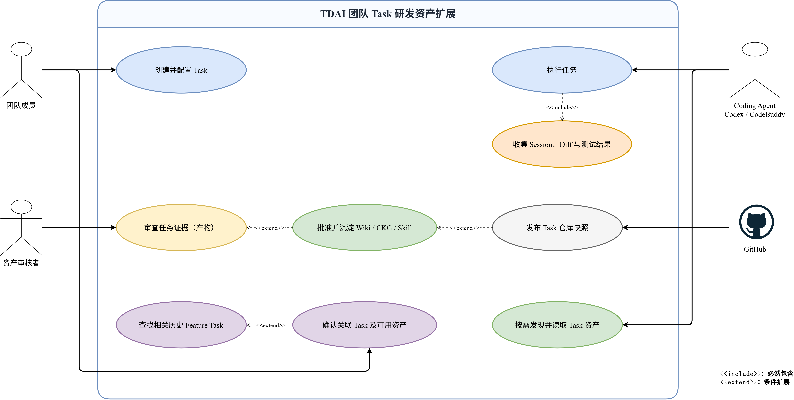
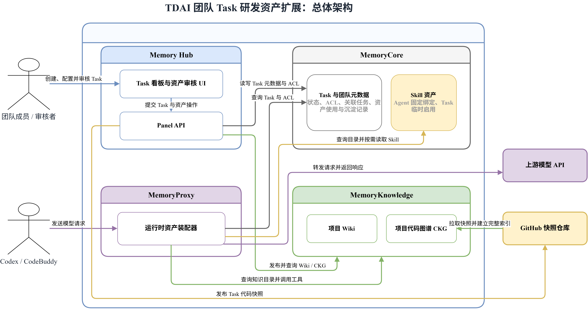

# TDAI 团队 Task 研发资产扩展 — Quick Start

本文档用于快速体验本次扩展的 Task 级资产沉淀、历史关联、按需利用与结果回写链路。

## 目录

- [背景与目标](#background-and-goals)
- [使用顺序](#usage-order)
- [1. 本次新增功能](#new-features)
  - [1.1 系统用例](#system-use-cases)
  - [1.2 总体架构](#overall-architecture)
- [2. 示例对象](#example-cases)
- [3. 运行前准备](#preparation)
  - [3.1 环境要求](#environment-requirements)
  - [3.2 配置](#configuration)
  - [3.3 构建扩展镜像](#build-images)
  - [3.4 启动与检查](#startup-and-check)
- [4. CodeBuddy Bug Fix](#codebuddy-bug-fix)
  - [4.1 准备隔离工作区](#codebuddy-bug-workspace)
  - [4.2 绑定 Bug Task 并生成运行清单](#codebuddy-bug-context)
  - [4.3 执行与自动回写](#codebuddy-bug-run)
- [5. CodeBuddy Feature Task](#codebuddy-feature)
  - [5.1 Feature Task Instruction](#codebuddy-feature-instruction)
  - [5.2 准备隔离工作区](#codebuddy-feature-workspace)
  - [5.3 创建 Feature Task 和运行清单](#codebuddy-feature-context)
  - [5.4 执行、验证并自动回写](#codebuddy-feature-run)
- [6. Codex Feature Task](#codex-feature)
  - [6.1 准备隔离工作区](#codex-feature-workspace)
  - [6.2 创建 Feature Task 和运行清单](#codex-feature-context)
  - [6.3 执行、验证并自动回写](#codex-feature-run)
- [7. Codex Bug Fix](#codex-bug-fix)
  - [7.1 准备隔离工作区](#codex-bug-workspace)
  - [7.2 绑定 Bug Task 并生成运行清单](#codex-bug-context)
  - [7.3 执行、验证并自动回写](#codex-bug-run)

<a id="background-and-goals"></a>
## 背景与目标

TDAI 已能在团队内管理 Wiki、项目代码图谱（CKG）、Skill 和 Chat Memory，并通过权限、Agent 配装与 Proxy 供 Coding Agent 使用。但这些资产原本主要按资产类型或 Agent 组织，没有与一次**具体研发任务的产生过程建立完整联系**：团队难以确认某项知识来自哪个 Task、由哪些代码和测试支撑，也难以在后续**相关任务**中找到并复用当时沉淀的资产。

本次扩展把 **Task 作为研发资产管理的基本单位**。在开源数据中，一个 PR 可以转化为 Task，PR 下的 commit 可以理解为 subtask；Agent 完成任务后，系统统一收集 Session、代码与文档 Diff、测试结果，形成待审核的 Wiki、CKG 和 Skill；审核通过后再写入团队资产。（对于无法合并到上游仓库的 Agent Patch，可发布独立的 Task 仓库快照并据此构建完整 CKG）

示例流程以 Seaborn `move_legend` 为例：
- 先由 Feature Task 实现 PR #2643 并沉淀研发资产；
- 随后以 Issue #3079 创建 Bug Fix Task，主动检索并关联历史 Feature Task，使新的 Agent 能按需使用 Feature 阶段留下的 Wiki、CKG 和 Skill；

修复结束后，产物再通过同一套通用链路回写。目标是得到团队可审核、可追溯、可复用的研发资产。

<a id="usage-order"></a>
## 使用顺序

1. 按第 3 章构建并启动 TDAI。
2. 在任务看板查看已完成的 Feature Task，审查 Diff、测试结果及待沉淀资产。
3. 创建 Bug Task，检索并关联历史 Feature Task 的 Wiki、CKG 和 Skill。
4. 从第 4～7 章选择一种 Harness 与 Task 类型，完成工作区准备、Agent 执行、验证和自动回写。

<a id="new-features"></a>
## 1. 本次新增功能

1. **Task 研发资产沉淀**：Agent 完成 Task 后，统一采集 Session、Git Diff、变更文件和测试结果，生成项目 Wiki、项目代码图谱（CKG）和团队 Skill 候选。
2. **产物可审查**：Task 详情页可按 GitHub Diff 形式查看代码/文档变更，也可展开查看每个 F2P、P2P 测试用例及结果。
3. **资产审核与合并**：Wiki 可新增或更新项目知识页；CKG 根据 Task 前后代码差异生成贡献实体和关系；Skill 从结构化 Session 中提取。三类资产均需人工确认后沉淀。
4. **Feature—Bug 历史任务关联**：Bug Task 可在同项目内主动检索已经完成且存在正式资产的 Feature Task。系统综合代码标识符、变更文件和 BM25 文本相关性返回候选，用户确认关联的历史 Task 与资产。
5. **Task 级资产利用**：关联资产只对当前 Bug Task 生效，不修改 Agent 的固定资产。Agent 经 TDAI Proxy 启动后，可按需使用 Wiki、CKG 和 Skill，而不是把全部资产正文一次性塞入上下文。

<a id="system-use-cases"></a>
### 1.1 系统用例

团队成员创建并配置 Task、确认关联的历史任务与可用资产；资产审核者检查 Session、Diff 和测试证据，再决定是否沉淀 Wiki、CKG 与 Skill；Codex/CodeBuddy 执行任务，并在运行时按需读取当前 Task 获准使用的资产。选择新增 Task 快照 CKG 时，系统才会把任务结果发布到 GitHub 快照仓库。

图中的 **include** 表示必经子过程，**extend** 表示仅在满足条件时执行的扩展过程。



<a id="overall-architecture"></a>
### 1.2 总体架构

Memory Hub 提供 Task 看板、历史关联和资产审核 UI，Panel API 负责读写 Task 元数据以及发布 Wiki、CKG 和代码快照。MemoryCore 保存 Task、团队权限与 Skill 资产，MemoryKnowledge 构建和查询项目 Wiki/CKG。Coding Agent 的模型请求经过 MemoryProxy；运行时资产装配器根据 Task 与 ACL 得到可用资产目录，供 Agent 按需查询，再将请求转发到上游模型 API。

架构图中的节点表示系统、组件、接口或数据对象，箭头标签表示组件之间的调用、查询、读写和发布操作。



<a id="example-cases"></a>
## 2. 示例对象

- 历史 Feature：[Seaborn PR #2643](https://github.com/mwaskom/seaborn/pull/2643)，为 Seaborn 增加 `move_legend`。
- 后续 Bug：[Seaborn Issue #3079](https://github.com/mwaskom/seaborn/issues/3079)，使用 `labels` 重命名图例项时，文本可能与原有颜色/handle 错配。
- 项目标识统一填写：`mwaskom/seaborn`。
- 已验证的历史 Feature Task：`Doc2Feat #2643：为 Seaborn 实现 move_legend（Codex gpt-5.6-sol v2（规格与环境修正））`。

| 章节 | Task 类型 | Harness | Task 准备方式 |
| --- | --- | --- | --- |
| 4 | Bug Fix | CodeBuddy | 输入已完成历史资产关联的 Bug Task ID |
| 5 | Feature | CodeBuddy | 脚本自动创建或复用 Feature Task |
| 6 | Feature | Codex | 脚本自动创建或复用 Feature Task |
| 7 | Bug Fix | Codex | 输入已完成历史资产关联的 Bug Task ID |

四套命令均自动准备 Agent、`tdai-context.json`、`run-manifest.json`，并在 Agent 成功后执行验证和通用回写。Bug Task 保留输入 ID 的步骤，是为了使用在 UI 中经过人工确认的历史资产关联结果。

<a id="preparation"></a>
## 3. 运行前准备

<a id="environment-requirements"></a>
### 3.1 环境要求

- Docker Desktop 已启动，并启用 WSL 2。
- WSL 中具备 Bash、Git、Docker CLI。
- 可选实跑需要 Windows PowerShell、Node.js 22、Conda，以及 Codex CLI 或 CodeBuddy CLI。

<a id="configuration"></a>
### 3.2 配置

首次运行时，在 WSL 中执行：

```bash
cd /mnt/d/projects/tencent_practice/TencentDB-Agent-Memory/deploy/global-images
cp .env.example .env
```

编辑 `.env`，至少配置两组模型参数；API Key 必须填真实值，但不要提交或公开该文件：

```dotenv
MEMORY_LLM_BASE_URL=<用于记忆与知识处理的模型地址>
MEMORY_LLM_API_KEY=<API Key>
MEMORY_LLM_MODEL=<模型 ID>
MEMORY_LLM_PROTOCOL=openai

PROXY_UPSTREAM_URL=<Coding Agent 使用的上游模型地址>
PROXY_UPSTREAM_API_KEY=<API Key>
PROXY_UPSTREAM_MODEL=<模型 ID>

# 可选：把验证通过的 Task 结果发布为独立仓库快照 CKG
TDAI_SNAPSHOT_GITHUB_OWNER=<GitHub 用户或组织>
TDAI_SNAPSHOT_GITHUB_TOKEN=<专用细粒度 Token>
TDAI_SNAPSHOT_REPO_PREFIX=tdai-snapshot
TDAI_SNAPSHOT_GIT_USER_NAME=TDAI Snapshot Bot
TDAI_SNAPSHOT_GIT_USER_EMAIL=<提交邮箱>

MEMORY_CORE_IMAGE=agentmemory/memory-core:latest
MEMORY_HUB_IMAGE=agentmemory/memory-hub:task-ckg-local
PROXY_IMAGE=agentmemory/memory-proxy:task-assets-local

MEMORY_CORE_PORT=8420
PANEL_PORT=8125
KNOWLEDGE_PORT=8424
PROXY_PORT=8096
KNOWLEDGE_PUBLIC_BASE_URL=http://host.docker.internal:8424/v3
```

若由系统自动创建公开快照仓库，GitHub Token 需要仓库 Administration 与 Contents 写权限；更稳妥的方式是先手工创建公开仓库 `tdai-snapshot-<owner>-<repo>`，再给该仓库的细粒度 Token 配置 Contents 读写权限。修改配置后执行 `./start-memory-hub.sh` 使其生效。不要公开 Token。

<a id="build-images"></a>
### 3.3 构建扩展镜像

当前本机已有扩展镜像时可跳过。代码变更后重新构建：

```bash
cd /mnt/d/projects/tencent_practice/TencentDB-Agent-Memory/deploy/panel-knowledge-combined
IMAGE_NAME=agentmemory/memory-hub IMAGE_TAG=task-ckg-local ./build.sh

cd /mnt/d/projects/tencent_practice/TencentDB-Agent-Memory
docker build -f MemoryProxy/Dockerfile.local \
  -t agentmemory/memory-proxy:task-assets-local MemoryProxy
```

<a id="startup-and-check"></a>
### 3.4 启动与检查

建议打开一个交互式 WSL 终端并保持该窗口运行：

```bash
cd /mnt/d/projects/tencent_practice/TencentDB-Agent-Memory/deploy/global-images
./verify.sh
./start-all.sh
```

不要用执行完立即退出的临时 WSL 进程承载服务；本机曾因此出现 `localhost:8125` 拒绝连接。

检查容器和接口：

```bash
docker ps --filter name=tdai-
curl -fsS http://127.0.0.1:8420/health
curl -fsS http://127.0.0.1:8424/health
curl -fsS http://127.0.0.1:8096/health
```

浏览器访问：<http://localhost:8125/>。停止服务但保留数据：

```bash
cd /mnt/d/projects/tencent_practice/TencentDB-Agent-Memory/deploy/global-images
./stop-all.sh
```

<a id="codebuddy-bug-fix"></a>
## 4. 可选：完整运行一次 CodeBuddy Bug Fix

需要实跑时，在 PowerShell 中操作。CodeBuddy 的最大执行轮数配置为 500。

<a id="codebuddy-bug-workspace"></a>
### 4.1 准备隔离工作区

```powershell
cd D:\projects\tencent_practice\TencentDB-Agent-Memory

$repo = (Resolve-Path -LiteralPath '.').Path
$case = Join-Path $repo 'benchmark\cases\seaborn-3079-bugfix'
$workspace = Join-Path $case 'workspaces\demo-codebuddy'
$runtime = Join-Path $case 'artifacts\demo-codebuddy'

powershell -ExecutionPolicy Bypass -File "$case\scripts\prepare-workspace.ps1" `
  -Workspace $workspace
```

该脚本只拉取 Case 的基线提交，随后移除 Git remote，避免 Agent 看到未来的 Golden Fix。

<a id="codebuddy-bug-context"></a>
### 4.2 绑定 Bug Task 并生成运行清单

从 Hub 复制已经确认历史资产关联的 Bug Task ID，替换下面唯一的占位值。脚本会自动创建或复用 CodeBuddy Agent、建立 Task—Agent 关联，并生成上下文和运行清单；不再手写 Team、Agent、User ID 或 JSON 文件。

```powershell
$bugTaskId = '<目标 Bug Task ID，例如 task-xxxxxxxxxx>'
if ($bugTaskId -match '^<') {
  throw '请先把 $bugTaskId 替换为 Hub 中真实的 Bug Task ID。'
}

New-Item -ItemType Directory -Path $runtime -Force | Out-Null
$env:SEABORN_3079_RUNTIME_DIR = $runtime
$env:SEABORN_3079_RUN_KIND = 'codebuddy'
$env:SEABORN_3079_TASK_ID = $bugTaskId
$env:TDAI_AGENT_NAME = 'CodeBuddy-Seaborn-3079'

try {
  node "$case\scripts\prepare-tdai-context.mjs"
  if ($LASTEXITCODE -ne 0) { throw 'CodeBuddy Bug Task 运行上下文生成失败。' }
} finally {
  Remove-Item Env:SEABORN_3079_RUNTIME_DIR -ErrorAction SilentlyContinue
  Remove-Item Env:SEABORN_3079_RUN_KIND -ErrorAction SilentlyContinue
  Remove-Item Env:SEABORN_3079_TASK_ID -ErrorAction SilentlyContinue
  Remove-Item Env:TDAI_AGENT_NAME -ErrorAction SilentlyContinue
}

$contextPath = Join-Path $runtime 'tdai-context.json'
if (-not (Test-Path -LiteralPath $contextPath)) {
  throw "Bug Task 运行上下文未生成：$contextPath"
}

$manifest = [ordered]@{
  schema_version = 1
  task_kind = 'bug'
  workspace = $workspace
  runtime_dir = $runtime
  instruction_file = (Join-Path $case 'instruction.zh-CN.md')
  project = [ordered]@{
    name = 'Seaborn'
    repo_url = 'https://github.com/mwaskom/seaborn.git'
    branch = 'issue-3079-codebuddy'
  }
  verification = @(
    [ordered]@{ name = 'Bug 功能测试'; command = 'pytest F2P'; junit_file = 'f2p-junit.xml' }
    [ordered]@{ name = '选定回归测试'; command = 'pytest P2P'; junit_file = 'p2p-junit.xml' }
  )
}

$manifestPath = Join-Path $runtime 'run-manifest.json'
[IO.File]::WriteAllText(
  $manifestPath,
  ($manifest | ConvertTo-Json -Depth 8),
  [Text.UTF8Encoding]::new($false)
)
if (-not (Test-Path -LiteralPath $manifestPath)) {
  throw "运行清单未写入预期目录：$manifestPath"
}
Write-Host "运行上下文：$contextPath"
Write-Host "运行清单：$manifestPath"
```

<a id="codebuddy-bug-run"></a>
### 4.3 执行与自动回写

```powershell
$env:TDAI_UPSTREAM_MODEL = 'gpt-5.6-sol'
$agentExitCode = 1
try {
  powershell -ExecutionPolicy Bypass -File "$case\scripts\run-codebuddy.ps1" `
    -Workspace $workspace `
    -RuntimeDir $runtime `
    -MaxTurns 500 `
    -Model 'gpt-5.6-sol'
  $agentExitCode = $LASTEXITCODE
} finally {
  Remove-Item Env:TDAI_UPSTREAM_MODEL -ErrorAction SilentlyContinue
}

if ($agentExitCode -ne 0) {
  throw 'CodeBuddy 执行失败，暂不运行验证和资产回写。'
}

powershell -ExecutionPolicy Bypass -File "$case\scripts\verify.ps1" `
  -Workspace $workspace `
  -RuntimeDir $runtime
```

`run-codebuddy.ps1` 会临时生成 CodeBuddy 模型配置，把请求指向：

```text
http://127.0.0.1:8096/codebuddy/default/v1/chat/completions
```

并携带 Team、Agent、Task 请求头。脚本结束后会恢复原来的 `%USERPROFILE%\.codebuddy\models.json`。

`verify.ps1` 运行 F2P/P2P、生成 JUnit 和 Patch，并自动调用：

```powershell
node benchmark/lib/task-run-finalizer.mjs --manifest "$runtime\run-manifest.json"
```

回到任务看板后，应看到 Task 状态更新为“已完成”，并出现真实 Diff、测试结果、Session 以及 Wiki/CKG/Skill 待审核资产。

<a id="codebuddy-feature"></a>
## 5. 可选：完整运行一次 CodeBuddy Feature Task

<a id="codebuddy-feature-instruction"></a>
### 5.1 Feature Task Instruction

需要从头运行 Feature 开发流程时，脚本会使用以下描述自动创建或复用 Task，无需先在 Hub 手工新建；Task 类型会按 Feature 记录，所属项目为 `mwaskom/seaborn`：

```text
# 任务：根据文档为 Seaborn 增加 `move_legend`

请在当前 Seaborn 仓库中实现一个公开的便捷函数 `seaborn.move_legend`。它用于移动已有图例，而不是要求调用方重新提供图例数据。

- 对 axes-level 图，支持 `sns.move_legend(ax, "center right")`；
- 支持直接传入带有图例的 Matplotlib `Figure`；
- 支持用 `bbox_to_anchor` 精细调整位置，包括把图例移到坐标轴外；
- 支持 `ncol`、`title`、`title_fontsize` 和 `frameon` 等 Matplotlib legend 参数；
- 支持 `FacetGrid`、`displot` 等 figure-level Grid；
- 保留原图例 handles、labels 和默认标题，允许显式标题覆盖；
- 仅支持 Seaborn Grid、Matplotlib Axes 和 Figure；对象类型不支持时抛出 `TypeError`，支持类型尚无图例时抛出 `ValueError`；
- 将函数加入公开 API，并补充必要的代码内文档。不要复制或硬编码测试期望。

请先阅读仓库现有图例创建方式和公开 API 组织方式，再实现并运行 `seaborn/tests/test_utils.py` 相关测试。不要提交 commit；采集器会统一记录工作区变更和验证结果。
```

<a id="codebuddy-feature-workspace"></a>
### 5.2 准备隔离工作区

在 PowerShell 中执行：

```powershell
cd D:\projects\tencent_practice\TencentDB-Agent-Memory

$repo = (Resolve-Path -LiteralPath '.').Path
$case = Join-Path $repo 'benchmark\cases\doc2feat-seaborn-2643'
$workspace = Join-Path $case 'workspaces\demo-feature-codebuddy'
$runtime = Join-Path $case 'artifacts\runs\demo-feature-codebuddy'

powershell -ExecutionPolicy Bypass -File "$case\scripts\prepare-workspace.ps1" `
  -Workspace $workspace
```

脚本只获取 `091f4c0e4f3580a8060de5596fa64c1ff9454dc5` 基线提交，创建本地分支后删除 Git remote，防止 Agent 从上游历史获得参考实现。

<a id="codebuddy-feature-context"></a>
### 5.3 创建 Feature Task 和运行清单

先确认 TDAI 已启动。以下命令会通过 TDAI API 动态创建或复用 Feature Task 和执行 Agent，并在 `$runtime` 中生成 `tdai-context.json`，不需要手写 Team、Task、Agent 或 User ID。此时只创建任务及执行上下文，不会预置 Wiki、CKG 或 Skill；资产审核区会在任务执行并完成通用回写后出现：

```powershell
New-Item -ItemType Directory -Path $runtime -Force | Out-Null

$env:DOC2FEAT_RUNTIME_DIR = $runtime
$env:DOC2FEAT_RUN_KIND = 'codebuddy'
$env:DOC2FEAT_RUN_LABEL = '演示 Feature Task'

try {
  node "$case\scripts\create-tdai-task.mjs"
  if ($LASTEXITCODE -ne 0) { throw 'CodeBuddy Feature Task 创建失败。' }

  $contextPath = Join-Path $runtime 'tdai-context.json'
  if (-not (Test-Path -LiteralPath $contextPath)) {
    throw "Task 已创建，但运行上下文未写入预期目录：$contextPath"
  }
  Write-Host "运行上下文：$contextPath"
} finally {
  Remove-Item Env:DOC2FEAT_RUNTIME_DIR -ErrorAction SilentlyContinue
  Remove-Item Env:DOC2FEAT_RUN_KIND -ErrorAction SilentlyContinue
  Remove-Item Env:DOC2FEAT_RUN_LABEL -ErrorAction SilentlyContinue
}
```

随后生成与本次目录对应的 `run-manifest.json`：

```powershell
$manifest = [ordered]@{
  schema_version = 1
  task_kind = 'feature'
  workspace = $workspace
  runtime_dir = $runtime
  instruction_file = (Join-Path $case 'instruction.zh-CN.md')
  project = [ordered]@{
    name = 'Seaborn'
    repo_url = 'https://github.com/mwaskom/seaborn.git'
    branch = 'doc2feat-2643-codebuddy'
  }
  verification = @(
    [ordered]@{ name = 'Feature 功能测试'; command = 'pytest F2P'; junit_file = 'f2p-junit.xml' }
    [ordered]@{ name = '选定回归测试'; command = 'pytest P2P'; junit_file = 'p2p-junit.xml' }
  )
}

$manifestJson = $manifest | ConvertTo-Json -Depth 8
[IO.File]::WriteAllText(
  (Join-Path $runtime 'run-manifest.json'),
  $manifestJson,
  [Text.UTF8Encoding]::new($false)
)

$manifestPath = Join-Path $runtime 'run-manifest.json'
if (-not (Test-Path -LiteralPath $manifestPath)) {
  throw "运行清单未写入预期目录：$manifestPath"
}
Write-Host "运行清单：$manifestPath"
```

这里的 `branch` 是隔离工作区中的本地分支，只作为运行来源记录；官方 `mwaskom/seaborn` 仓库不需要存在该分支。

<a id="codebuddy-feature-run"></a>
### 5.4 执行、验证并自动回写

```powershell
$env:TDAI_UPSTREAM_MODEL = 'gpt-5.6-sol'
$agentExitCode = 1
try {
  powershell -ExecutionPolicy Bypass -File "$case\scripts\run-codebuddy.ps1" `
    -Workspace $workspace `
    -RuntimeDir $runtime `
    -MaxTurns 500 `
    -RequestModelId 'gpt-5.6-sol'
  $agentExitCode = $LASTEXITCODE
} finally {
  Remove-Item Env:TDAI_UPSTREAM_MODEL -ErrorAction SilentlyContinue
}

if ($agentExitCode -ne 0) {
  throw 'CodeBuddy 执行失败，暂不运行验证和资产回写。'
}

powershell -ExecutionPolicy Bypass -File "$case\scripts\verify-and-collect.ps1" `
  -Workspace $workspace `
  -RuntimeDir $runtime
```

`run-codebuddy.ps1` 会把请求发送到本机 TDAI Proxy，并携带刚生成的 Team、Agent、Task 请求头。脚本已在 Windows PowerShell 5.1 与原生进程之间强制使用 UTF-8，无需手动执行 `chcp`。`verify-and-collect.ps1` 会运行 F2P/P2P、生成 JUnit 与 Git Patch，再调用通用回写器更新任务看板和待沉淀资产。

<a id="codex-feature"></a>
## 6. 可选：完整运行一次 Codex Feature Task

前提是 `codex --version` 可正常执行。以下命令使用独立工作区和运行目录，不会覆盖 CodeBuddy 的产物。

<a id="codex-feature-workspace"></a>
### 6.1 准备 Codex 隔离工作区

在一个新的 PowerShell 窗口中执行：

```powershell
cd D:\projects\tencent_practice\TencentDB-Agent-Memory

$repo = (Resolve-Path -LiteralPath '.').Path
$case = Join-Path $repo 'benchmark\cases\doc2feat-seaborn-2643'
$workspace = Join-Path $case 'workspaces\demo-feature-codex'
$runtime = Join-Path $case 'artifacts\runs\demo-feature-codex'

powershell -ExecutionPolicy Bypass -File "$case\scripts\prepare-workspace.ps1" `
  -Workspace $workspace
```

<a id="codex-feature-context"></a>
### 6.2 创建 Codex Feature Task 和运行清单

先确认 TDAI 已启动，然后执行：

```powershell
New-Item -ItemType Directory -Path $runtime -Force | Out-Null

$env:DOC2FEAT_RUNTIME_DIR = $runtime
$env:DOC2FEAT_RUN_KIND = 'codex'
$env:DOC2FEAT_RUN_LABEL = '演示 Codex Feature Task'

try {
  node "$case\scripts\create-tdai-task.mjs"
  if ($LASTEXITCODE -ne 0) { throw 'Codex Feature Task 创建失败。' }
} finally {
  Remove-Item Env:DOC2FEAT_RUNTIME_DIR -ErrorAction SilentlyContinue
  Remove-Item Env:DOC2FEAT_RUN_KIND -ErrorAction SilentlyContinue
  Remove-Item Env:DOC2FEAT_RUN_LABEL -ErrorAction SilentlyContinue
}

$contextPath = Join-Path $runtime 'tdai-context.json'
if (-not (Test-Path -LiteralPath $contextPath)) {
  throw "Task 已创建，但运行上下文未写入预期目录：$contextPath"
}

$manifest = [ordered]@{
  schema_version = 1
  task_kind = 'feature'
  workspace = $workspace
  runtime_dir = $runtime
  instruction_file = (Join-Path $case 'instruction.zh-CN.md')
  project = [ordered]@{
    name = 'Seaborn'
    repo_url = 'https://github.com/mwaskom/seaborn.git'
    branch = 'doc2feat-2643-codex'
  }
  verification = @(
    [ordered]@{ name = 'Feature 功能测试'; command = 'pytest F2P'; junit_file = 'f2p-junit.xml' }
    [ordered]@{ name = '选定回归测试'; command = 'pytest P2P'; junit_file = 'p2p-junit.xml' }
  )
}

$manifestPath = Join-Path $runtime 'run-manifest.json'
[IO.File]::WriteAllText(
  $manifestPath,
  ($manifest | ConvertTo-Json -Depth 8),
  [Text.UTF8Encoding]::new($false)
)

if (-not (Test-Path -LiteralPath $manifestPath)) {
  throw "运行清单未写入预期目录：$manifestPath"
}
Write-Host "运行上下文：$contextPath"
Write-Host "运行清单：$manifestPath"
```

`branch` 仍然只是隔离工作区的运行来源标识，不要求官方仓库存在同名分支。

<a id="codex-feature-run"></a>
### 6.3 执行 Codex、验证并自动回写

```powershell
$agentExitCode = 1
powershell -ExecutionPolicy Bypass -File "$case\scripts\run-codex.ps1" `
  -Workspace $workspace `
  -RuntimeDir $runtime `
  -Model 'gpt-5.6-sol'
$agentExitCode = $LASTEXITCODE

if ($agentExitCode -ne 0) {
  throw "Codex 执行失败，暂不运行验证和资产回写。请检查 $runtime\codex-stderr.log"
}

powershell -ExecutionPolicy Bypass -File "$case\scripts\verify-and-collect.ps1" `
  -Workspace $workspace `
  -RuntimeDir $runtime
```

<a id="codex-bug-fix"></a>
## 7. 可选：完整运行一次 Codex Bug Fix

先在 Hub 中创建 Bug Task，在详情页将任务类型设为“Bug 修复”、填写项目标识，并检索、确认需要关联的历史 Feature Task 及资产。通过 TDAI Codex Proxy 调用模型，使已分配的 Wiki、CKG 和 Skill 在执行期间可被发现和按需读取。

<a id="codex-bug-workspace"></a>
### 7.1 准备 Codex Bug Fix 隔离工作区

```powershell
cd D:\projects\tencent_practice\TencentDB-Agent-Memory

$repo = (Resolve-Path -LiteralPath '.').Path
$case = Join-Path $repo 'benchmark\cases\seaborn-3079-bugfix'
$workspace = Join-Path $case 'workspaces\demo-codex'
$runtime = Join-Path $case 'artifacts\demo-codex'

powershell -ExecutionPolicy Bypass -File "$case\scripts\prepare-workspace.ps1" `
  -Workspace $workspace
```

<a id="codex-bug-context"></a>
### 7.2 绑定 Bug Task 并生成运行清单

从 Hub 的目标 Bug Task 详情复制 Task ID，替换下面唯一的占位值。必须选择已经确认关联历史 Feature 资产的 Bug Task，不能用 Feature Task ID。

```powershell
$bugTaskId = '<目标 Bug Task ID，例如 task-xxxxxxxxxx>'
if ($bugTaskId -match '^<') {
  throw '请先把 $bugTaskId 替换为 Hub 中真实的 Bug Task ID。'
}

New-Item -ItemType Directory -Path $runtime -Force | Out-Null
$env:SEABORN_3079_RUNTIME_DIR = $runtime
$env:SEABORN_3079_RUN_KIND = 'codex'
$env:SEABORN_3079_TASK_ID = $bugTaskId
$env:TDAI_AGENT_NAME = 'Codex-Seaborn-3079'

try {
  node "$case\scripts\prepare-tdai-context.mjs"
  if ($LASTEXITCODE -ne 0) { throw 'Codex Bug Task 运行上下文生成失败。' }
} finally {
  Remove-Item Env:SEABORN_3079_RUNTIME_DIR -ErrorAction SilentlyContinue
  Remove-Item Env:SEABORN_3079_RUN_KIND -ErrorAction SilentlyContinue
  Remove-Item Env:SEABORN_3079_TASK_ID -ErrorAction SilentlyContinue
  Remove-Item Env:TDAI_AGENT_NAME -ErrorAction SilentlyContinue
}

$contextPath = Join-Path $runtime 'tdai-context.json'
if (-not (Test-Path -LiteralPath $contextPath)) {
  throw "Bug Task 运行上下文未生成：$contextPath"
}

$manifest = [ordered]@{
  schema_version = 1
  task_kind = 'bug'
  workspace = $workspace
  runtime_dir = $runtime
  instruction_file = (Join-Path $case 'instruction.zh-CN.md')
  project = [ordered]@{
    name = 'Seaborn'
    repo_url = 'https://github.com/mwaskom/seaborn.git'
    branch = 'issue-3079-codex'
  }
  verification = @(
    [ordered]@{ name = 'Bug 功能测试'; command = 'pytest F2P'; junit_file = 'f2p-junit.xml' }
    [ordered]@{ name = '选定回归测试'; command = 'pytest P2P'; junit_file = 'p2p-junit.xml' }
  )
}

$manifestPath = Join-Path $runtime 'run-manifest.json'
[IO.File]::WriteAllText(
  $manifestPath,
  ($manifest | ConvertTo-Json -Depth 8),
  [Text.UTF8Encoding]::new($false)
)
if (-not (Test-Path -LiteralPath $manifestPath)) {
  throw "运行清单未写入预期目录：$manifestPath"
}
Write-Host "运行上下文：$contextPath"
Write-Host "运行清单：$manifestPath"
```

`prepare-tdai-context.mjs` 会验证目标 Task：GitHub Task 校验 Issue #3079 URL；Hub 手工 Task 没有 `source_url` 时，改为校验任务类型是 Bug、所属项目是 `mwaskom/seaborn`。随后脚本创建或复用 `Codex-Seaborn-3079` Agent，并把它关联到指定 Bug Task。

<a id="codex-bug-run"></a>
### 7.3 执行 Codex、验证并自动回写

```powershell
$agentExitCode = 1
powershell -ExecutionPolicy Bypass -File "$case\scripts\run-codex.ps1" `
  -Workspace $workspace `
  -RuntimeDir $runtime `
  -Model 'gpt-5.6-sol'
$agentExitCode = $LASTEXITCODE

if ($agentExitCode -ne 0) {
  throw "Codex 执行失败，暂不运行验证和资产回写。请检查 $runtime\codex-stderr.log"
}

powershell -ExecutionPolicy Bypass -File "$case\scripts\verify.ps1" `
  -Workspace $workspace `
  -RuntimeDir $runtime
```

该 runner 会创建隔离的 Codex 配置，将 Responses API 指向 `http://127.0.0.1:8096/codex/default/v1`，并从 `tdai-context.json` 动态写入 Team、Agent、Task 请求头。TDAI Proxy 据此装配该 Bug Task 已确认的历史资产；运行结束后，`verify.ps1` 生成测试、Diff 和 Session 证据并调用通用回写器。
