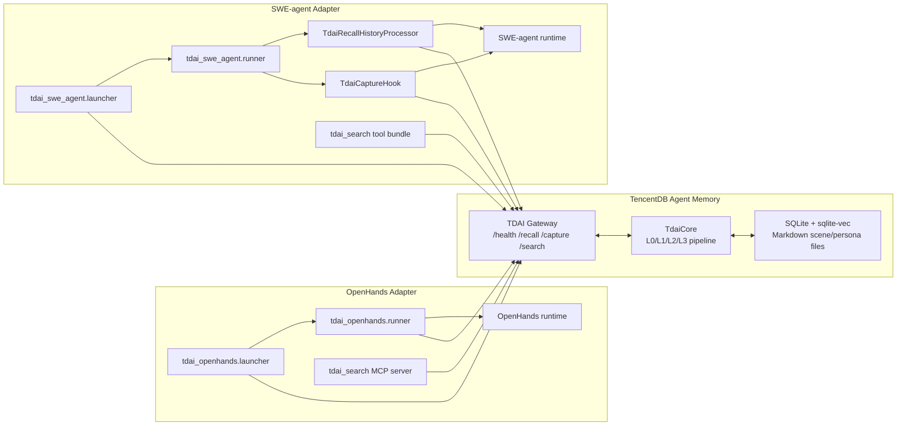
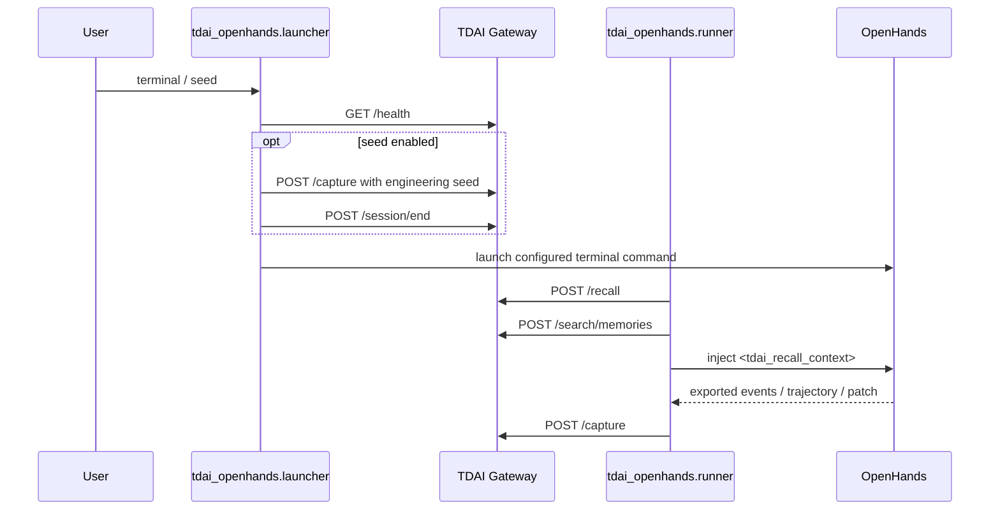
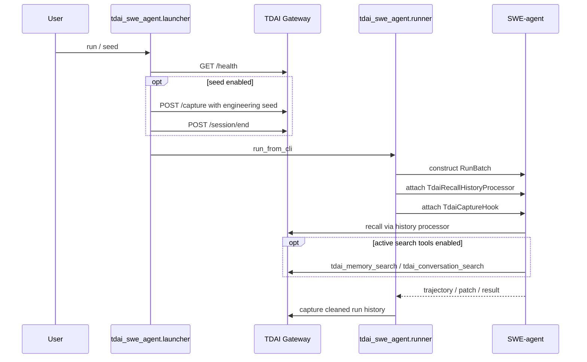

# OpenHands and SWE-agent Adapters for TDAI

This document describes the OpenHands and SWE-agent adapters for TencentDB Agent Memory (TDAI).
The implementation follows a conservative integration rule: do not patch the host agent core; add a platform adapter layer around stable TDAI Gateway APIs.

## Goals

- Add long-term memory recall and capture for OpenHands.
- Add long-term memory recall, capture, and optional active search tools for SWE-agent.
- Keep OpenHands and SWE-agent core logic unchanged.
- Keep TDAI Gateway `/recall`, `/capture`, and `/search` semantics unchanged.
- Provide launcher configs so users can clone the repo, configure parameters, seed software-engineering memories, and start the target platform with one command.

## High-Level Architecture



## OpenHands Data Flow



The OpenHands adapter can be used in three modes:

- `recall`: build a TDAI recall block for an OpenHands task.
- `prepare-request`: inject recall into an OpenHands app-server start request JSON.
- `capture`: capture exported OpenHands artifacts after a run.

The launcher adds a convenience path for local users: Gateway check/start, seed injection, and OpenHands terminal entrypoint execution.

## SWE-agent Data Flow



The SWE-agent adapter wraps `RunBatch` without modifying SWE-agent source files.
It injects recall through a history processor and captures the completed run through an agent hook.

## Why Gateway Instead of HostAdapter

The existing OpenClaw integration can use an in-process `HostAdapter` because it runs inside the TypeScript plugin environment.
OpenHands and SWE-agent are Python projects with their own runtime and process model.

For these platforms, the stable integration boundary is the TDAI Gateway:

- It avoids TypeScript/Python in-process coupling.
- It keeps the host platforms unmodified.
- It allows the same memory store to be shared across OpenClaw, Hermes, OpenHands, SWE-agent, and future platforms.
- It mirrors real SWE-bench usage, where the agent platform runs as an external evaluator/runner.

## Directory Layout

```text
src/adapters/openhands/
  configs/
    tdai-longterm-only.yaml
    tdai-openhands-launcher.yaml
  tdai_openhands/
    client.py
    prompt.py
    runner.py
    launcher.py
    capture.py
  tools/tdai_search/
    tdai_mcp_server.py
  tests/

src/adapters/swe-agent/
  configs/
    tdai-longterm-only.yaml
    tdai-sweagent-launcher.yaml
  tdai_swe_agent/
    client.py
    history_processor.py
    capture_hook.py
    runner.py
    launcher.py
  tools/tdai_search/
    config.yaml
    bin/tdai_memory_search
    bin/tdai_conversation_search
  tests/
```

## Launcher Workflow

OpenHands:

```bash
export PYTHONPATH="$PWD/src/adapters/openhands:$PYTHONPATH"
export TDAI_LLM_API_KEY="..."
python -m tdai_openhands.launcher \
  --launcher-config src/adapters/openhands/configs/tdai-openhands-launcher.yaml \
  terminal
```

SWE-agent:

```bash
export PYTHONPATH="$PWD/src/adapters/swe-agent:/path/to/SWE-agent:$PYTHONPATH"
export TDAI_LLM_API_KEY="..."
python -m tdai_swe_agent.launcher \
  --launcher-config src/adapters/swe-agent/configs/tdai-sweagent-launcher.yaml \
  run
```

Both launchers support a `seed` command for engineering-memory injection without starting the host platform.

## Verification

Local adapter tests:

```text
OpenHands adapter tests: 14 passed
SWE-agent adapter tests: 4 passed
```

Clone-based launcher validation:

- Cloned branch `feat/openhands-swe-agent-tdai-adapters` from `Veteran-ChengQin/TencentDB-Agent-Memory`.
- Confirmed launcher `--help` works for both adapters.
- Confirmed seed injection writes L0 records and calls `/session/end`.
- Confirmed OpenHands launcher can transfer control to the configured terminal entrypoint.
- Re-ran adapter tests from the cloned checkout.

Detailed clone validation commands are recorded in `src/adapters/ISSUE_235_SUBMISSION_CN.md`.
